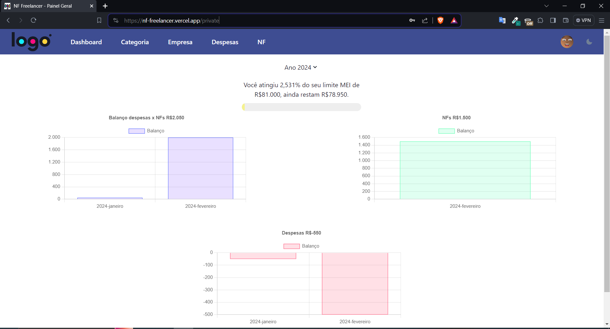
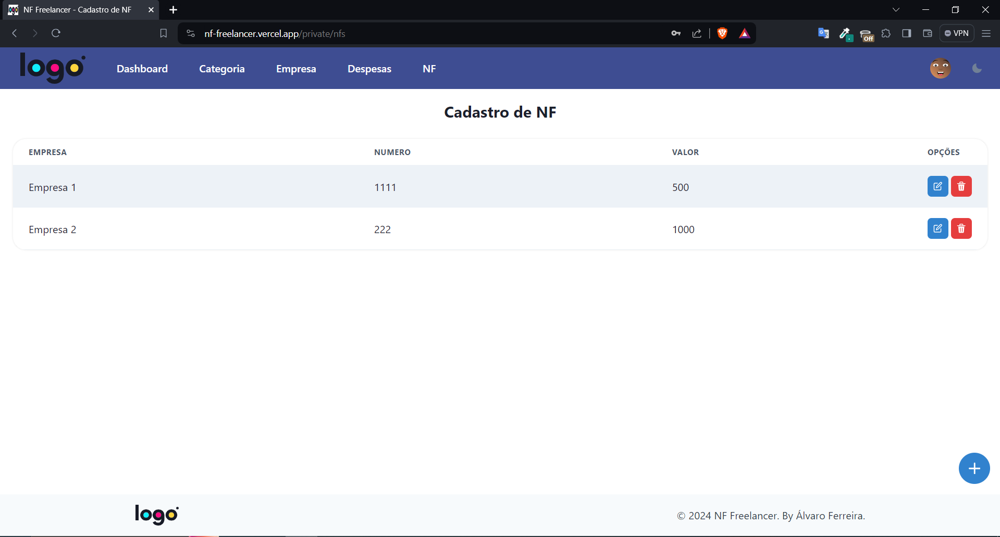
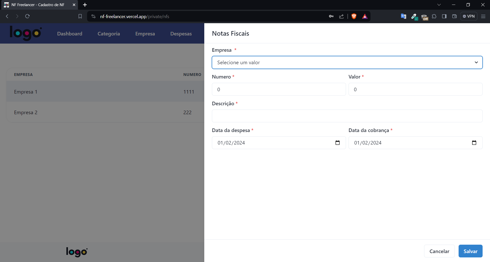
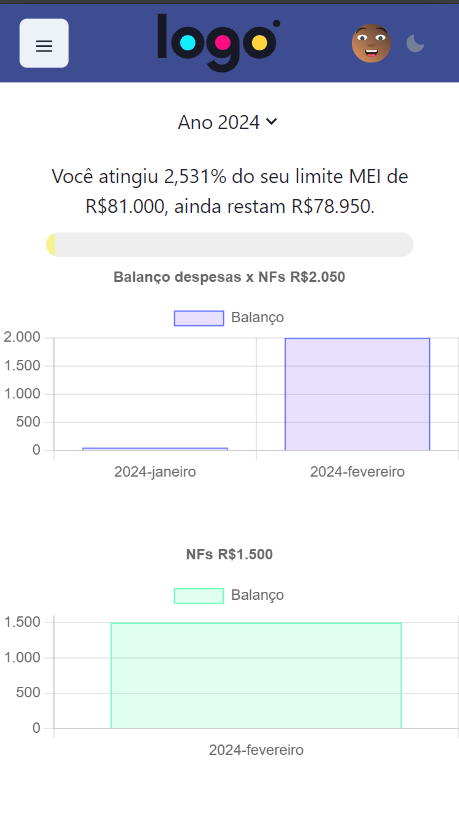

## ACCESS PROJECT IN PRODUCTION ENVIRONMENT
 - https://nf-freelancer.vercel.app
 - Create yout account
 - Create Sample 'Categoria', 'Empresa', 'Despesa', 'NF'
 - See the dashboard with your data.

## ALL FEATURES
 - Sign up ✅
 - Sign in ✅
 - Auth and security ✅
 - Categories ✅
 - Companies ✅
 - Dossie ✅
 - Expenses ✅
 - NF ✅
 - Reports ✅
 - Responsive pages ✅
 - Notification system 🔨

## TO RUN LOCAL THIS PROJECT
 - Install dependencies: `npm i`
 - Run local on development environment: `npm run dev`
 - You must create a new project and populate the basics data.

## DEPLOY ON VERCEL
 - Install vercel CLI: `npm install -g vercel`
 - Vercel login: `vercel login`
 - Vercel deploy: `vercel`

## DATABASE MONGOOSE
 - This project are using a mongoose remote database
 - Backup: `mongodump --uri="MONGO_URI"`

## PROJECT IMAGES

